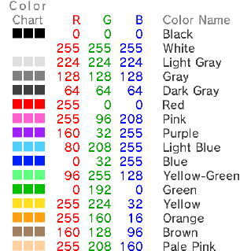
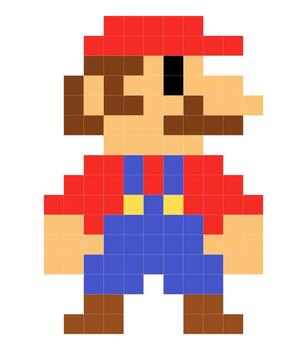
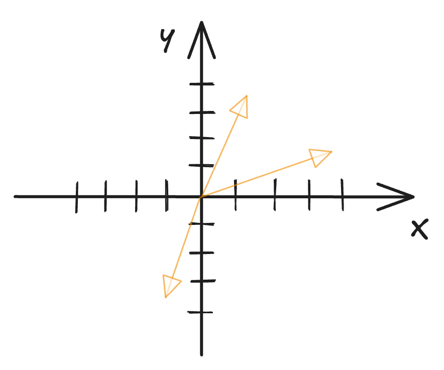
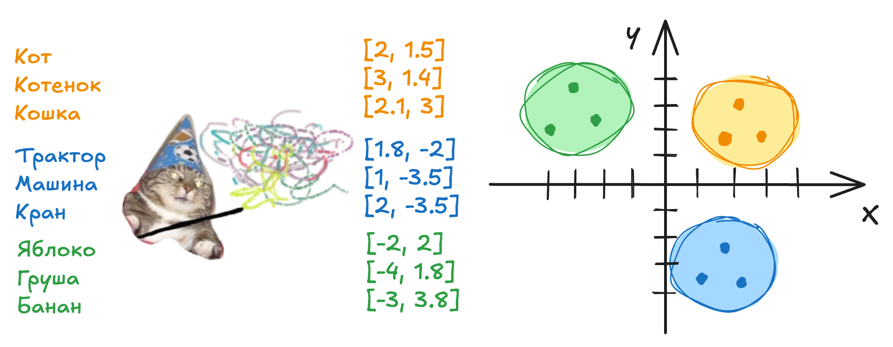
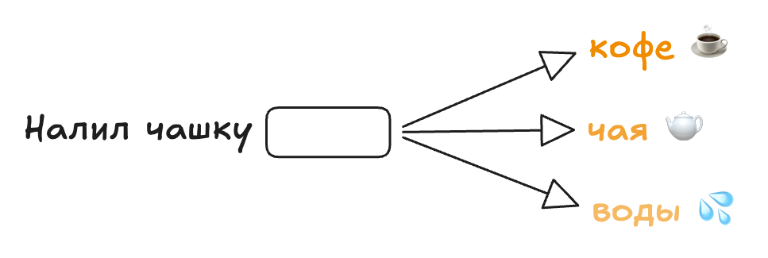
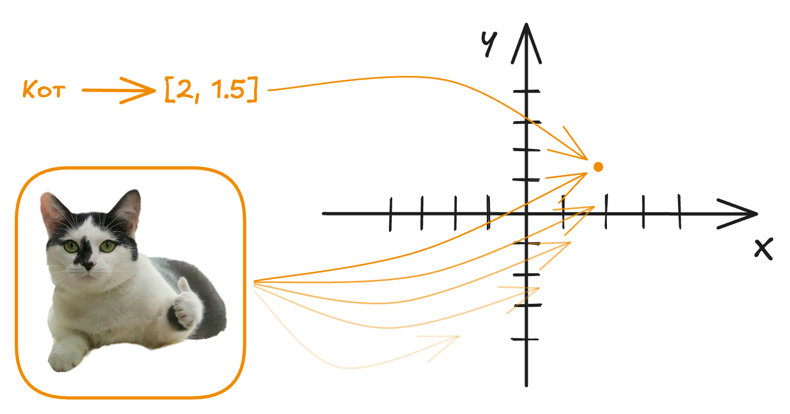
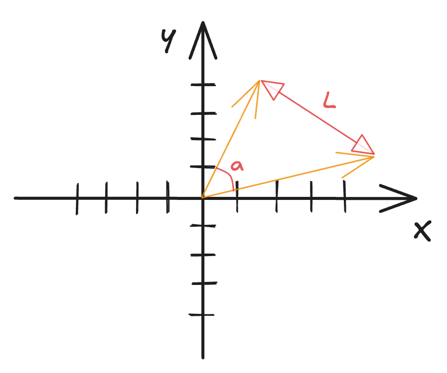
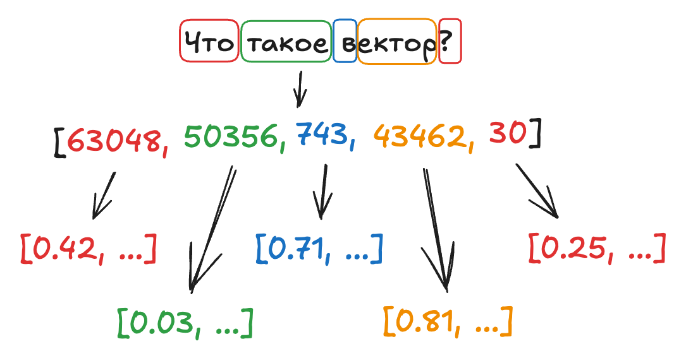
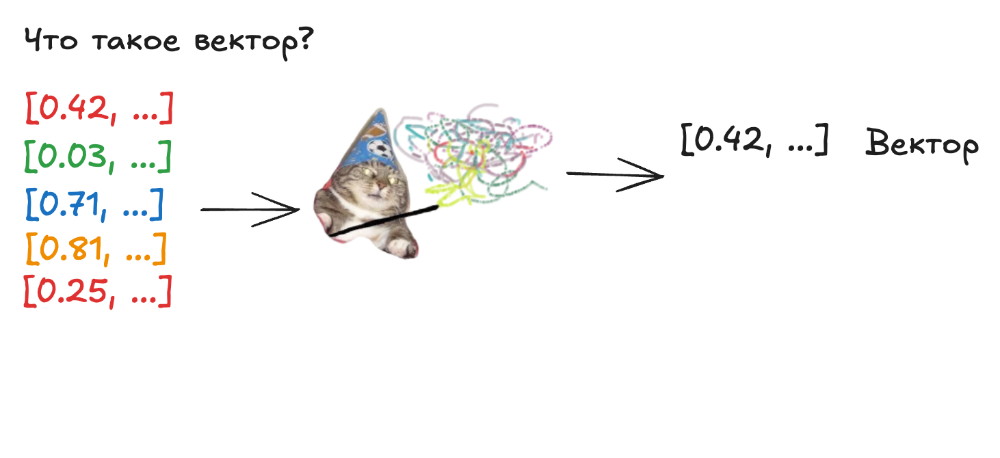
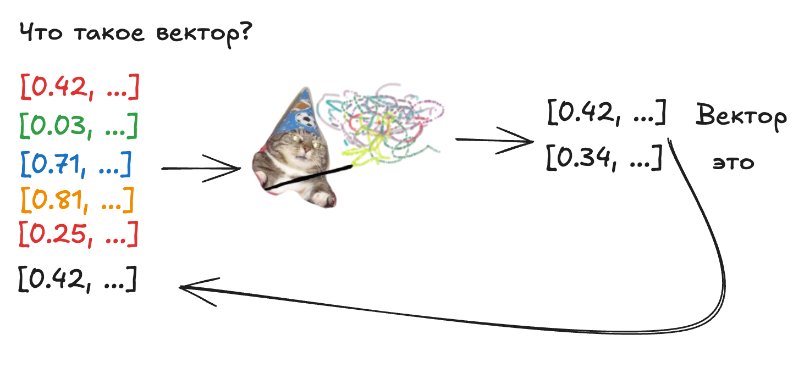

<!-- _class: lead -->
<!-- _paginate: false -->
<!-- _header: '' -->

# Эмбеддинги и точка
## как нейросети понимают смысл

<!-- Открывающий слайд. Пообещайте залу: к концу они поймут, как машина понимает смысл, хотя умеет только считать. ~2 минуты на представление себя. -->

---

## План на сегодня

* Как компьютер видит и читает
* Векторы — карта смыслов
* Что с этими векторами можно делать
* Зачем это бизнесу
* Как это связано с ChatGPT и LLM

<!-- Короткая навигация. Не задерживайтесь — 30 секунд. -->

---

## Как компьютер видит текст
### Машина понимает только числа

- **Символ** — у каждого символа свой номер в таблице символов (ASCII, Unicode…)
- **Слово** — последовательность таких кодов

| Слово | Коды символов (Unicode) | Слово одним числом (сумма кодов) |
|---|---|---|
| **кот** | 1082 + 1086 + 1090 | **3258** |
| **сад** | 1089 + 1072 + 1076 | **3237** |
| **котёнок** | 1082 + 1086 + 1090 + 1105 + 1085 + 1086 + 1082 | **7616** |

По таким кодам «кот» (3258) ближе к «сад» (3237), чем к «котёнок» (7616).
Числа считаются по написанию — по буквам и длине, а не по смыслу.

<!-- Это смысловой стержень всей лекции. Проговорите медленно. Покажите парадокс: по кодам букв «кот» оказывается ближе к «сад» (оба короткие, похожие суммы), чем к родному по смыслу «котёнок» — числа отражают написание, а не смысл. Поставьте вопрос ребром и сделайте паузу — следующий раздел будет ответом. ~5 минут. -->

---

## Картинки

- **Изображение** — набор пикселей, каждый пиксель кодируется 3 числами — яркость каналов: красного, зелёного и синего (RGB)
- Но и эти числа — про цвет пикселей, а не про смысл: два похожих кота дадут совсем разные наборы пикселей

<figure>

<figcaption>Цвет = 3 числа (RGB)</figcaption>
</figure>
<figure>

<figcaption>Картинка = сетка таких пикселей</figcaption>
</figure>

---

## Векторы

**Вектор** — направленный отрезок с координатами

Эмбеддинг — тот же вектор, только:

- координат не две, а сотни
- близость означает «похожесть по смыслу»

«Кошка» и «котёнок» — соседи. «Кошка» и «трактор» — далеко.

<figure>

</figure>

<!-- Сначала дайте образ карты, потом термин «вектор». Демо «Карта игр» — через слайд, тут только образ. ~3 минуты. -->

---

## Эмбеддинги

<!-- Не произносите слово «вектор» первым — сначала образ карты. Демо «Карта игр» — на следующем слайде. -->

---

## Демо: карта игр

1000 игр как точки на 2D-карте — ищем соседей по игре или свободному тексту (`open world rpg with dragons`). Жанры сами собираются в «материки».

🎮 **Демо:** https://game-map.streamlit.app/
💻 **Код:** https://github.com/vanya-black/innopolis

> Почему отвечает мгновенно? Эмбеддинги посчитаны заранее —
> в реальном времени лишь вектор запроса и поиск ближайших.

<!-- Это «карта смыслов» вживую: смысл стал точкой, похожесть — близостью. Начните с поиска по игре из списка (надёжно), потом возьмите свободный запрос из зала. Если совпадение неожиданное — обыграйте: «по простым признакам так; умный вектор учёл бы содержание». ~3 минуты. -->

---

## Как происходит "ВЖУХ"

Никто не расставлял слова руками. Модель играет в «угадай пропущенное»:

- Берём миллиарды текстов и прячем в них по слову — это маскирование
- Промахнулась — получила штраф и поправила векторы. И так миллиарды раз

> «Слово узнаётся по компании.»
> Слова из похожих контекстов получают похожие координаты —
> и карта смыслов складывается сама.

<!-- Это «как» к предыдущему «вжуху». Идея одна: модель не зубрила определения, а играла в «заполни пропуск» на гигантском тексте. Кто стоит в похожем окружении — встаёт рядом на карте. Принцип Фёрта «You shall know a word by the company it keeps» — можно процитировать, если зал технический. Не уходите в BERT/GPT и loss — это следующий уровень. ~3 минуты. -->

---

## А как же картинки?

С картинками — тот же приём, что и с текстом:

- миллионы пар «картинка <> подпись»
- вектор картинки встаёт рядом с вектором подписи
- общая карта смыслов для текста и картинок — это и есть CLIP

<figure>

</figure>

<!-- Главная мысль: не новая магия, а тот же приём, что и для текста. Свяжите явно с прошлым слайдом: текст учился игрой «угадай пропущенное» — картинки учатся игрой «подбери верную подпись» из множества чужих. Промахнулась — поправила векторы, и так миллионы раз. Не произносите «контрастивное обучение» и не уходите в архитектуру CLIP — хватает образа «встали рядом на одной карте». Пуант про «фото кота рядом со словом кошка» — это же мостик к кейсу «поиск по картинкам» дальше. ~2 минуты. -->

---

## Похожесть = близость точек

- Раз смысл — это точки, то похожесть — это близость
- А близость можно посчитать одним числом

Машина выдаёт число — насколько два смысла похожи
(по прямому расстоянию или по направлению — «косинусное сходство»).

Формулы не важны. Важен сам шаг: смысл → число похожести.

<figure>

</figure>

<!-- Не углубляйтесь в математику. Это мостик к кейсам: «сейчас увидим, зачем это число нужно». ~4 минуты. -->

---

## Зачем это бизнесу

- **Семантический поиск** — ищешь «обувь для бега», находишь кроссовки
- **Рекомендации** — «похожие товары», «похожие фильмы»
- **Кластеризация** — разложить тысячи обращений по темам без ручной разметки
- **Поиск по картинкам** — «найди визуально похожее»
- **RAG** — ассистент находит нужный документ по смыслу, прежде чем ответить

> Везде одно: превратить объект в координаты смысла и искать ближайших.

<!-- Бейте конкретикой, по одной живой истории на кейс. Это самый ожидаемый нетехнической частью зала блок. ~7 минут. -->

---

## Где это ломается

- **«Похоже» ≠ «правда».** Вектор ловит совпадения, а не факты — поиск может уверенно выдать похожий, но неверный документ
- **Смещения из данных.** Та же геометрия, что дала «король → королева», выдаёт и «врач → мужчина, медсестра → женщина» — модель впитала стереотипы текстов
- **Контекст обманчив.** «Хорошо» и «не очень хорошо» могут оказаться рядом; редкие термины, сарказм и отрицание — слабые места
- **Векторы ≠ анонимизация.** По эмбеддингу можно частично восстановить исходный текст — хранить вектор почти то же, что хранить сами данные

> На практике: вектор от одной модели несравним с вектором от другой —
> сменили модель — переиндексируйте всё заново.

<!-- Слайд-«прививка от хайпа»: после блока применений честно покажите грабли — это поднимает доверие технической части зала. Свяжите смещения с тем самым примером «король → королева»: у красивой геометрии есть тёмная сторона. Приватность спрашивают чаще всего — подчеркните: вектор это НЕ обезличивание. ~3 минуты. -->

---

## Причем тут ChatGPT и Claude

<figure>

</figure>

<!-- Отвечает на частый вопрос: токен — это не эмбеддинг, а индекс к нему. Статичный вектор → контекстный. Голосом: «Что такое вектор?» → токены → номера в словаре → стартовые векторы из таблицы → дальше уточняются по контексту (пример с «луком»). -->

---

## LLM - генерация ответа

<figure>

</figure>

<!-- Ключевое различие: эмбеддер останавливается на векторе; LLM делает шаг «вектор → распределение по словарю → токен» и крутит это в цикле (авторегрессия). Голосом: промпт → векторы → «вжух» → новый вектор → слово, и стрелки заворачивают обратно — слово за словом рождается текст. Если спросят про обучение: тот же приём «угадай по контексту» из слайда про «вжух», только LLM угадывает не пропуск в середине, а следующее слово. -->

---

## LLM - генерация ответа

<figure>

</figure>

<!-- Стрелка завернула обратно: новое слово «Вектор» снова стало входом — модель дописывает по одному слову. -->

---

## LLM - генерация ответа

<figure>

</figure>

<!-- Следующий шаг: из нового вектора рождается слово «это». -->

---

## LLM - генерация ответа

<figure>

</figure>

<!-- И снова петля: «это» возвращается на вход. Так, слово за словом, и собирается ответ. -->

---

## Посмотрим вживую — нарисуй и найди

**Нарисуй — найди похожее** — рисунок на холсте → CLIP находит визуально похожие фото. Рисунок и фотографии живут в одном пространстве смыслов.

🖌️ **Демо:** https://sketch-search.streamlit.app
💻 **Код:** https://github.com/vanya-black/innopolis

<!-- Чёрным по белому, крупно и по центру — CLIP ловит категорию и форму (кошка → кошки), но не точную позу: рисунок и фото разные «домены» — это и есть мостик к слайду «где ломается». Эмбеддинги посчитаны заранее — в реальном времени лишь вектор рисунка и поиск ближайших. -->

---

<!-- _class: lead -->
<!-- _header: '' -->

## и финальное

В чем сила?

Что угодно превратить в вектор — и найти ближайшее по смыслу

<!-- Финальный замок лекции. -->

---

<!-- _class: lead -->
<!-- _paginate: false -->
<!-- _header: '' -->

## Спасибо

<!-- Готовые ответы держите наготове: откуда берутся координаты; чем эмбеддинги отличаются от LLM; многозначные слова (контекстные эмбеддинги); приватность векторов. -->